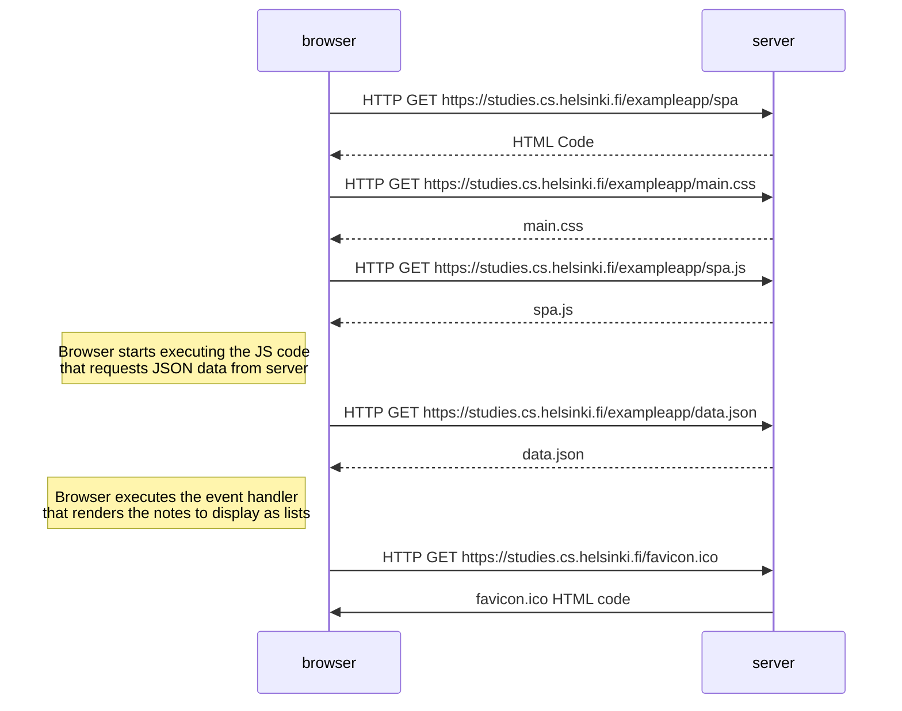

```mermaid
sequenceDiagram
participant browser
participant server
browser->>server: HTTP GET https://studies.cs.helsinki.fi/exampleapp/spa
server-->>browser: HTML Code
browser->>server: HTTP GET https://studies.cs.helsinki.fi/exampleapp/main.css
server-->>browser: main.css
browser->>server: HTTP GET https://studies.cs.helsinki.fi/exampleapp/spa.js
server-->>browser: spa.js
Note left of browser: Browser starts executing the JS code <br/>that requests JSON data from server
browser->>server: HTTP GET https://studies.cs.helsinki.fi/exampleapp/data.json
server-->>browser: data.json
Note left of browser: Browser executes the event handler <br/>that renders the notes to display as lists
browser->>server: HTTP GET https://studies.cs.helsinki.fi/favicon.ico
server->>browser: favicon.ico HTML code
```
